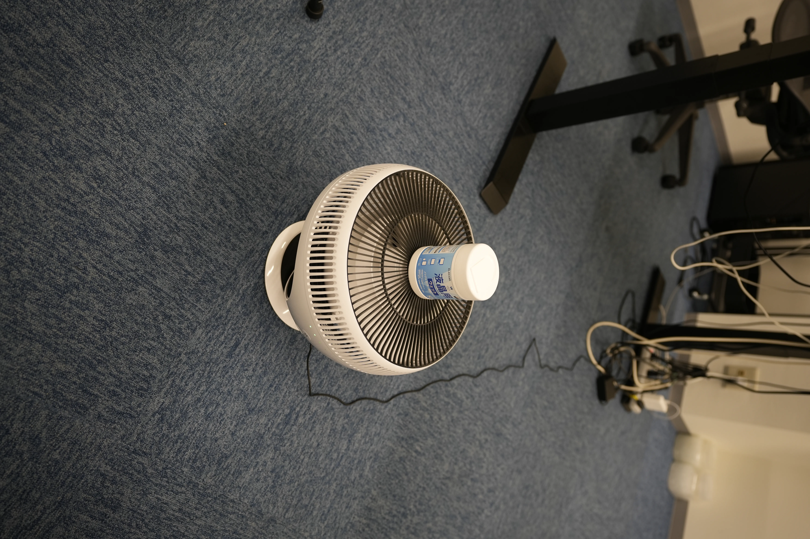
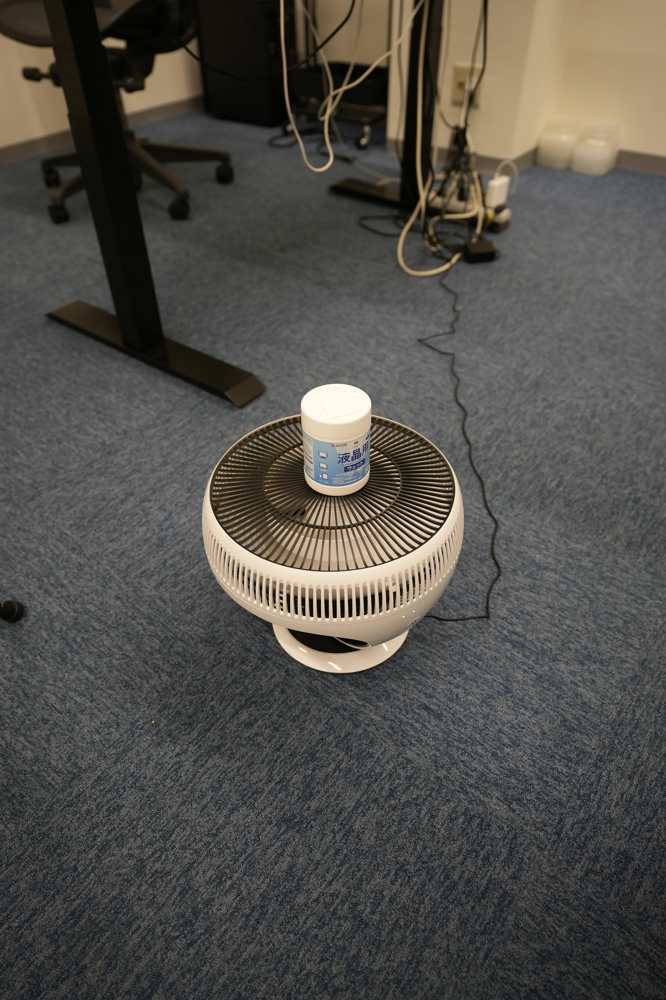
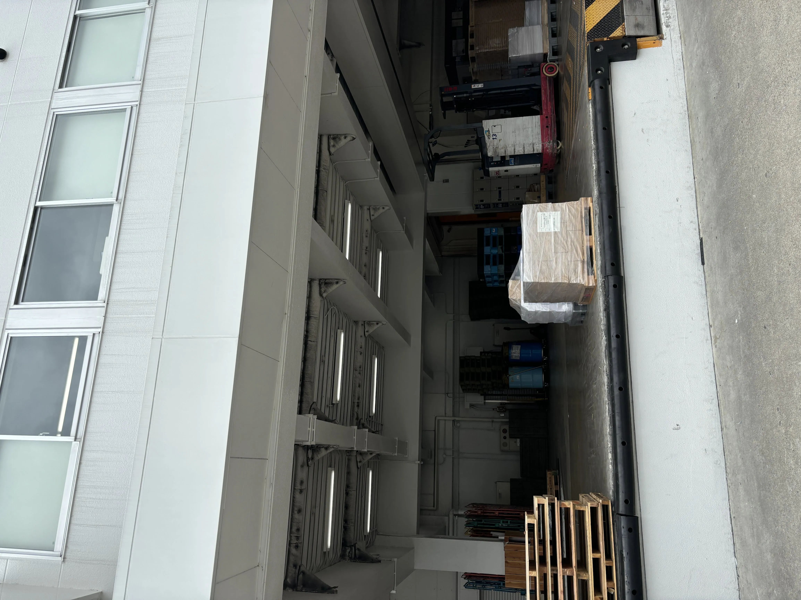
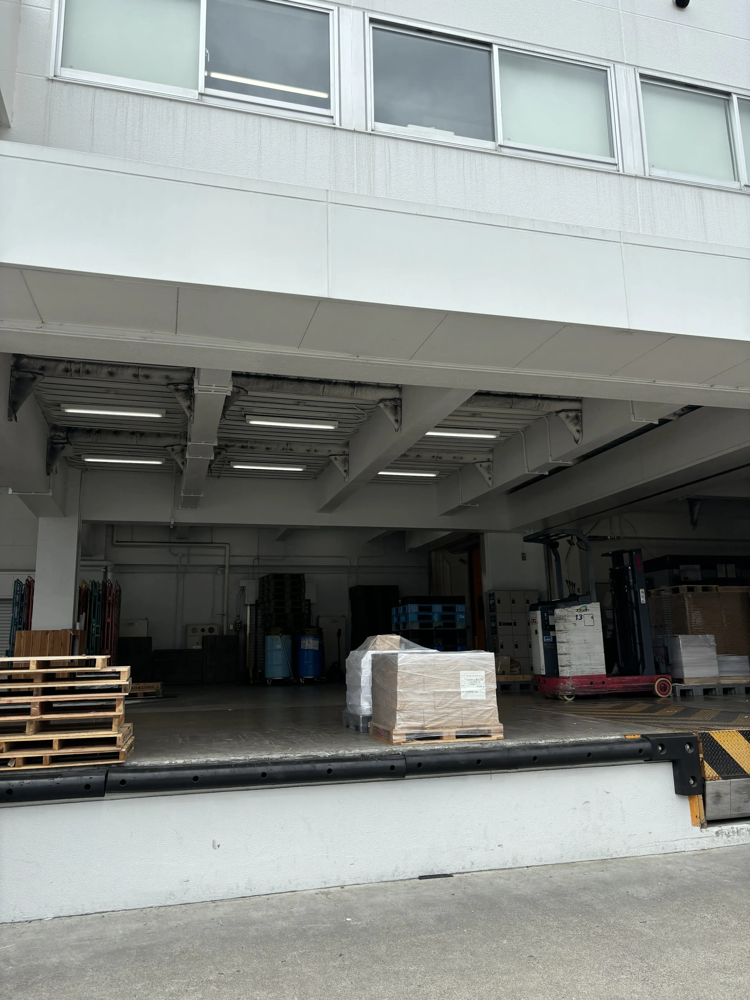
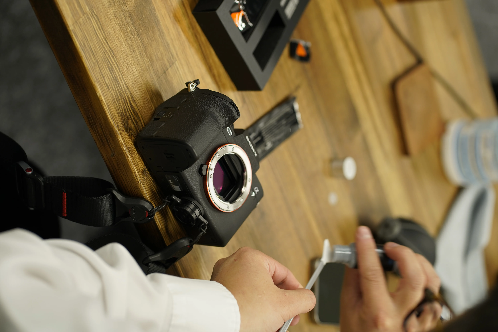
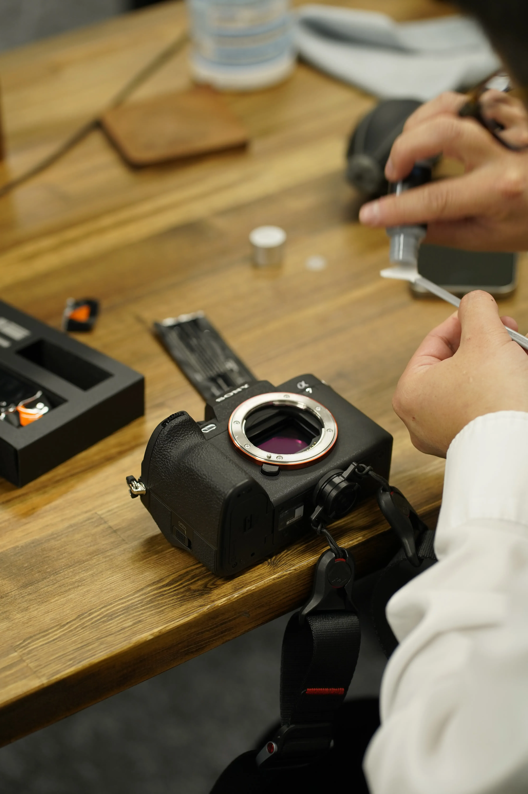
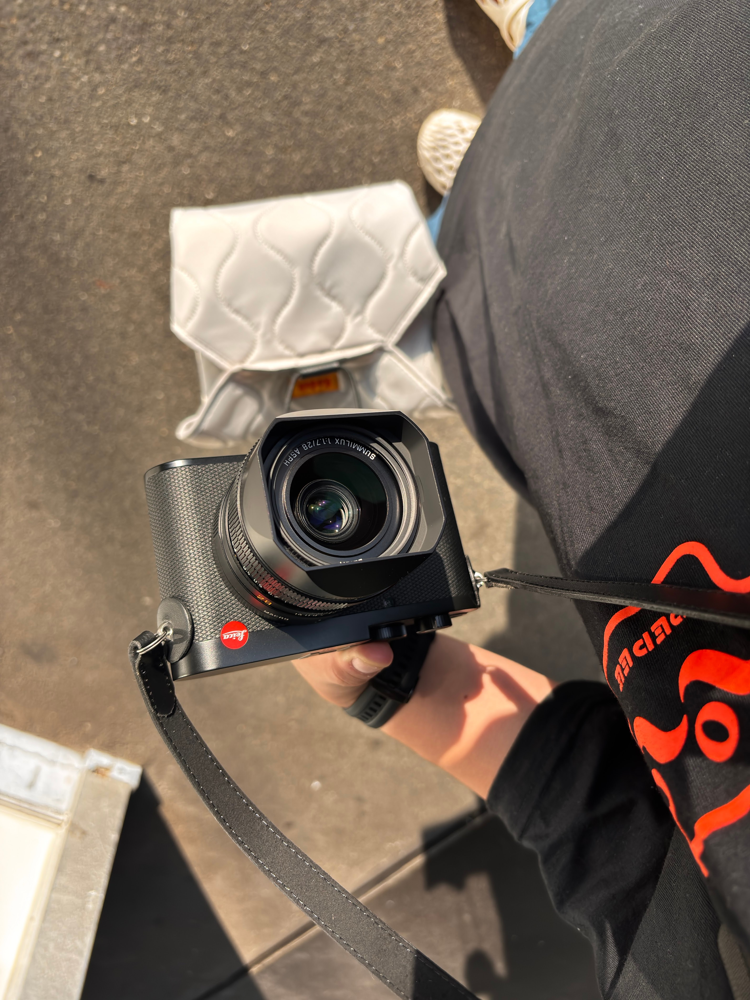

# くるりAI CLI

ViTモデルで画像の回転角を判定するCLIです。CPU / CUDA / Apple MPSで動作し、チェックポイントはGitHub
Releaseから初回自動ダウンロードできます。単一ファイルまたはディレクトリ再帰処理に対応し、補正画像の保存も行えます。

## 特徴

- 初回実行時にモデルが無ければ自動ダウンロード（URL・sha256は引数または環境変数で設定可能）
- 単一画像とディレクトリ一括処理の両対応
- 補正済み画像の保存オプションあり
- Pythonのみで完結し、型付き・最小依存

## 必要環境

- Python 3.12.9
- PyTorch, TorchVision, timm, Pillow（`uv pip install -e cli` で導入）

## セットアップ

```bash
git clone https://github.com/kandotrun/kururi-ai.git
cd kururi-ai
uv venv .venv
source .venv/bin/activate
uv pip install -e cli
```

## モデル自動ダウンロード

- `models/kururi-orient-v1.pth` が無い場合、指定URLから取得します。

```bash
export KURURI_MODEL_URL="https://github.com/<owner>/<repo>/releases/download/v0.1.0/kururi-orient-v1.pth"
export KURURI_MODEL_SHA256="<sha256sum>"
export KURURI_MODEL_TIMEOUT=1800   # 任意
```

- デフォルトURLはプレースホルダ `https://github.com/OWNER/REPO/releases/download/v0.1.0/kururi-orient-v1.pth`
  なので、公開後に実URLへ置き換えてください。

## 使い方

単一画像:

```bash
uv run python cli/main.py predict \
  --image /path/to/image.jpg \
  --device cpu \
  --model-name vit_large_patch16_224 \
  --save-rotated /path/to/fixed.jpg
```

ディレクトリ再帰処理:

```bash
uv run python cli/main.py predict \
  --dir /path/to/images \
  --save-rotated-dir outputs \
  --device cpu \
  --model-name vit_large_patch16_224
```

対応拡張子: jpg, jpeg, png, bmp, tif, tiff, webp。

同梱サンプルで試す（再帰処理）:

```bash
uv run python cli/main.py predict \
  --dir samples \
  --save-rotated-dir samples_out \
  --device cpu
```

サンプル入力と補正結果（サムネイル表示）:

| # | 入力                                                               | 補正後出力                                                                 |
|---|------------------------------------------------------------------|-----------------------------------------------------------------------|
| 1 |  |  |
| 2 |  |  |
| 3 |  |  |
| 4 |  |  |
| 5 |   |   |

### チェックポイント関連オプション

- `--checkpoint` 保存先パス（既定 `models/kururi-orient-v1.pth`）
- `--checkpoint-url` ダウンロードURL
- `--checkpoint-sha256` 整合性検証用ハッシュ
- `--download-timeout` タイムアウト秒（既定 1800 または `KURURI_MODEL_TIMEOUT`）

## GitHub Release への登録手順

1. ハッシュ取得: `shasum -a 256 models/kururi-orient-v1.pth`
2. Releaseを作成し、アセットとして `kururi-orient-v1.pth` をアップロード。
3. READMEと環境変数例、コード内のデフォルトURLを実URLとsha256に更新。

## ライセンス

- コードと同梱モデルは MIT ライセンスで提供します。`LICENSE` を参照してください。
- 元モデル開発者: 新野ユキ (Yuki Arano)
    - Twitter: https://x.com/yuki_arano
    - GitHub: https://github.com/ObuchiYuki
    - 元ツイート: https://x.com/yuki_arano/status/1788051297108902073
    -
    iOSアプリ: https://apps.apple.com/jp/app/ai%E3%81%8C%E5%86%99%E7%9C%9F%E3%81%AE%E5%90%91%E3%81%8D%E3%82%92%E4%BF%AE%E6%AD%A3-%E3%81%8F%E3%82%8B%E3%82%8Aai/id6480589907
